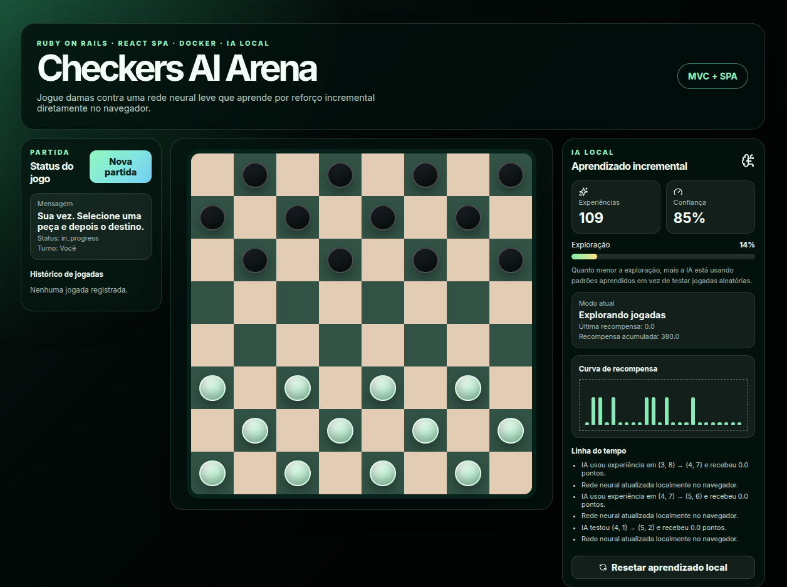

# Checkers AI Arena

Projeto web simples com **Ruby on Rails API**, **React SPA**, **Docker**, **PostgreSQL** e uma IA local leve baseada em **TensorFlow.js** para jogar damas contra o usuário.

A IA roda no navegador e utiliza uma rede neural pequena com aprendizado por reforço simplificado. A interface mostra o aprendizado incremental de forma visual para um público leigo.



## Como rodar

Na pasta do projeto:

```bash
docker compose up --build
```

Acesse:

```txt
http://localhost:5173
```

Backend Rails:

```txt
http://localhost:3000/health
```

## Caso queira começar do zero

```bash
docker compose down -v
docker compose up --build
```

## Arquitetura

```txt
checkers-ai-arena/
├── backend/        Ruby on Rails API em arquitetura MVC
├── frontend/       React SPA + TensorFlow.js
└── docker-compose.yml
```

## Serviços Docker

| Serviço | Porta | Função |
|---|---:|---|
| frontend | 5173 | SPA React |
| backend | 3000 | Rails API |
| db | 5434 | PostgreSQL |

## Endpoints úteis

```txt
GET    /health
POST   /api/v1/games
GET    /api/v1/games/:id
POST   /api/v1/games/:id/play
GET    /api/v1/ai/stats
POST   /api/v1/ai/training_events
POST   /api/v1/ai/snapshots
GET    /api/v1/ai/snapshots/latest
DELETE /api/v1/ai/snapshots
```

## O que a IA faz

A IA usa uma rede neural pequena no navegador:

- entrada: representação compacta das 32 casas jogáveis;
- saída: estimativa de valor para um estado do tabuleiro;
- estratégia: combina exploração aleatória com escolha por maior pontuação;
- aprendizado: após cada jogada da IA, recebe recompensa e faz um pequeno treino incremental.

Exemplos de recompensas:

| Situação | Recompensa |
|---|---:|
| Capturar peça | +10 |
| Virar dama | +20 |
| Perder peça | -8 |
| Vitória | +100 |
| Derrota | -100 |

## Como apresentar o projeto

> Desenvolvi uma aplicação web em Ruby on Rails com SPA em React para jogar damas contra uma IA local. A IA utiliza uma rede neural leve com aprendizado por reforço simplificado, ajustando suas decisões conforme recebe recompensas positivas ou negativas durante as partidas. A interface mostra esse aprendizado de forma visual, exibindo experiências aprendidas, confiança, exploração e evolução das recompensas.

## Observações

Este é um MVP didático. A IA não tem o objetivo de ser uma engine profissional de damas, mas sim demonstrar arquitetura web, regras de negócio, Docker, SPA e aprendizado incremental local.


## Correção aplicada: Rails Host Authorization

Em desenvolvimento, o Rails foi configurado com `config.hosts.clear` para permitir que o proxy do Vite encaminhe chamadas para `http://backend:3000`. Sem essa configuração, o Rails 8 pode bloquear as chamadas internas do Docker com `Blocked hosts: backend:3000`, retornando HTTP 403 no frontend.
